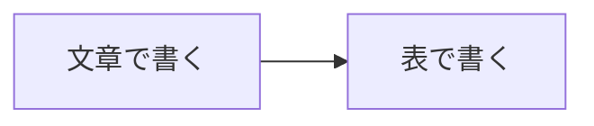

# 差異メモを表の形で書いてよいか決める
業務: 経費精算の点検 | 種別: 確認 | 期限: 2026-10-31 | 急ぎ: いいえ
> 問いの番号ごとに、いちばん下の『回答』の Q1: Q2: のあとに答え(はい・いいえ など)を書いて保存し、AI に「伺いに答えた」と伝えてください。会話で答えても構いません(AI が書き写します)。人間が行う操作は、済んだら ひとこと: に『実行済み』と書いてください。
## 結論(AIのおすすめ)
表の形をおすすめします。件数と金額を一目で比べられるからです。
## 背景
差異メモの書き方はまだ決まっていません。人が読む成果物なので、docs/ に HTML で置きます(AGENTS.md 5節)。
## 判断ポイント
1. 差異メモを表の形にする
   はいなら: AI が次の差異メモから表で書く / いいえなら: あなたが望む形を ひとこと: に書く
## 図解
差異メモの形が、文章から表に変わります。

## 問い
1. 次の差異メモから、表の形で書いてよいですか?
## AIが確かめたこと
- 根拠: AGENTS.md 1節の完了条件と5節(2026-10-01 確認)
- 実行済みでないことの確認: 差異メモはまだ1枚も作っていない
- 戻し方: 次のメモから元の形に戻せる
## 回答
Q1: はい
Q2: 
Q3: 
ひとこと: その案で進めてください
検証用リンク: AGENTS.md
