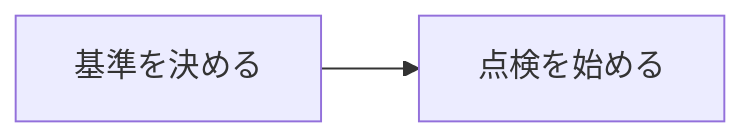

# 差異とみなす金額の基準を決める
業務: 経費精算の点検 | 種別: 承認 | 期限: 2026-12-31 | 急ぎ: いいえ
> 問いの番号ごとに、いちばん下の『回答』の Q1: Q2: のあとに答え(はい・いいえ など)を書いて保存し、AI に「伺いに答えた」と伝えてください。会話で答えても構いません(AI が書き写します)。人間が行う操作は、済んだら ひとこと: に『実行済み』と書いてください。
## 結論(AIのおすすめ)
1円でも合わなければ差異とする案をおすすめします。見落としを防ぐためです。
## 背景
点検を始める前に、どこからを差異と呼ぶかを決める必要があります。基準は合格基準にあたるので、AI は決めません(AGENTS.md 4節)。
## 判断ポイント
1. 1円以上の違いを差異とする
   はいなら: AI がこの基準で点検を進める / いいえなら: あなたが基準の金額を ひとこと: に書く
## 図解
基準が決まると、点検を始められます。

## 問い
1. 1円以上の違いを差異としてよいですか?
## AIが確かめたこと
- 根拠: AGENTS.md 1節の完了条件と4節(2026-10-01 確認)
- 実行済みでないことの確認: 点検はまだ始めていない
- 戻し方: 基準は後から変えられる
## 回答
Q1:
Q2:
Q3:
ひとこと:
検証用リンク: AGENTS.md
