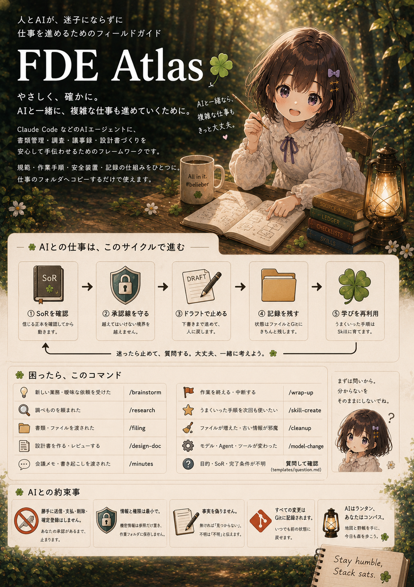
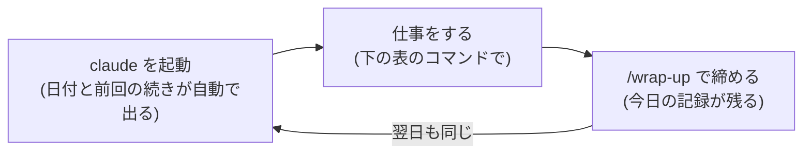

# FDE Atlas — AIに仕事を安心して手伝ってもらうための道具一式



[](LICENSE)
[](#)
[](https://github.com/anthropics/claude-code)
[](template/)

**書類の整理・調べもの・議事録・設計書づくりを、Claude Code などのAIに安心して任せるためのセット**です。
「AIへのお願いごとのルール」「よく使う作業の手順書」「危ない操作を止める安全装置」「作業の記録」がひとまとめになっていて、**仕事のフォルダにコピーするだけ**で使えます。プログラミングの知識はいりません。

中身は `template/` フォルダひとつ、196KB・48ファイルだけの薄い構成です。余計な依存もセットアップも増えないので、まずコピーして試し、合わなければフォルダごと消すだけで元に戻せます。

> **なぜ作ったか。** AIに仕事を手伝ってほしい。でも「勝手にメールを送られたら?」「ファイルを消されたら?」「わからないことを、それらしくでっち上げられたら?」——そんな不安で任せきれない人のために、「AIがやってよいこと・いけないこと」を最初から決めてある状態を用意しました。

## 3分ではじめる

```sh
git clone https://github.com/CobaltSato/fde-atlas.git
fde-atlas/scripts/install.sh ~/仕事のフォルダ    # いまあるファイルは上書きしません
cd ~/仕事のフォルダ
claude        # 初回は「信頼しますか?」と聞かれます → 内容を見てOKする
> /setup      # AIがあなたの仕事の内容を質問して、設定を作ってくれます
```

はじめの `/setup` では、AIが「どんな仕事か」「大事なファイルはどこにあるか」「どこまで任せてよいか」を順番に聞いてきます。答えるだけで準備完了です。

インストールはファイルをコピーするだけで、追加のソフトやアカウント登録は不要です。合わなかったら `~/仕事のフォルダ` から `.claude/` や `template/` 由来のファイルを削除すれば、跡形なく元に戻せます。

## 毎日のリズム



朝claudeを開くと「今日の日付・前回どこまでやったか・次にやること」が自動で表示されます。迷ったら「現在地表を見て」とAIに言えば、いまの状況に合う次の一手を案内してくれます。

## こういう時は、このコマンド

| したいこと | 打つコマンド |
|---|---|
| 頭の中を整理したい・仕事の頼み方を決めたい | `/brainstorm`(壁打ち相手になってくれる) |
| 調べてほしい(出どころつきで) | `/research` |
| 書類・ファイルを分類して一覧表につけたい | `/filing` |
| 設計書を作りたい・チェックしてほしい | `/design-doc` |
| 会議メモから「決まったこと」と「宿題」を出したい | `/minutes` |
| 今日の作業を終える・中断する | `/wrap-up` |
| うまくいったやり方を次回も使いたい | `/skill-create` |
| ファイルが増えて散らかってきた | `/cleanup`(棚卸し) |
| AIのモデル・ツールが変わった | `/model-change` |

## AIとの約束事(このセットに最初から入っているルール)

- **メール送信・支払い・削除・正式な登録は、AIはやりません。** 下書きまで作って、あなたに「これでいいですか?」と確認して止まります
- **わからないことは推測せず、質問してきます。** 見つからなかった情報を、それらしく作ったりしません
- **メールや書類の中に紛れこんだ「AIへの指示」には従いません。** 見つけたら止まって、原文つきで報告します(なりすましメール・詐欺文書への対策です)
- **すべての変更は記録されます。** 「昨日の状態に戻して」が、いつでもできます

## よくある質問

**Q. AIが途中で止まって質問してきた。故障?**
A. 正常です。「わからないときは止めて聞く」のがこのセットのルールです。答えれば続きから進みます。

**Q. /コマンドを打っても出てこない**
A. フォルダの中に `.claude/skills/` があるか確認してください。Claude Code以外のAIツールを使う場合は、`.claude/skills/<名前>/SKILL.md` というファイルを開いて「この手順どおりにやって」と渡せば、同じことができます。

**Q. 起動しても日付などが表示されない**
A. ターミナルで `chmod +x .claude/hooks/*.sh` を実行してみてください。Windowsの場合は Git Bash というアプリが必要です。

**Q. もしAIがまったく使えなくなったら?**
A. 大丈夫なように作ってあります。`source-map.md`(大事なファイルの場所一覧)→ `ledger.md`(書類の一覧表)→ `checklists/`(チェックリスト)→ `work/STATUS.md`(次にやること)の順に読めば、人間だけで仕事を続けられます。年に1回はAIなしで1周してみる「避難訓練」をおすすめします。

## 設定を変えたいとき

| 変えたいこと | 開くファイル |
|---|---|
| AIに任せてよい範囲 | コピー先の AGENTS.md「1. このプロジェクトの定義」 |
| 書類の名前の付け方 | context/rules.md |
| 設計書のチェック観点 | checklists/design-doc-review.md |
| AIに使わせないコマンド | .claude/settings.json と .claude/hooks/guard-bash.sh |

## もっと詳しく

- **設計の考え方と仕事の流れの図解(ブラウザで開けます)**: [design/kaisetsu.html](design/kaisetsu.html)
- なぜこういう作りにしたのか(読みもの): [fde-guide.md](fde-guide.md)
- このセット自体の設計メモと今後の予定: [design/blueprint.md](design/blueprint.md)
- コピーされる中身そのもの: `template/` フォルダ

## 改善の提案・不具合の報告

Issue・PR歓迎です。詳しくは [CONTRIBUTING.md](CONTRIBUTING.md) をどうぞ。

## License

[MIT](LICENSE)
