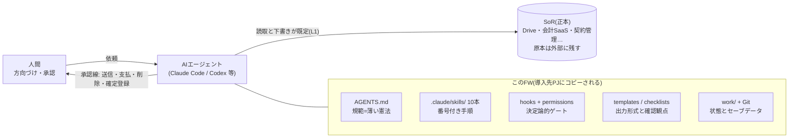

# fde-kit — 事務・SI業務のためのAIハーネスFW

**[fde-guide.md](fde-guide.md)(業務ハーネス設計規範)を、そのまま任意のプロジェクトで使える形にしたフレームワーク。**
対象は壁打ち・調査・書類管理・設計書などの非コーディング業務。コーディング用ではありません。
設計目標は規範と同じ — **モデルやベンダーが替わっても業務が回り続けること**。強いモデルの知見を、弱いモデルでも実行できる手順(スキル)と決定論的なゲート(hooks)に焼き付けてあります。

## 構成(ハーネスの層)



## クイックスタート

```sh
git clone <このリポジトリ> fde-kit
fde-kit/scripts/install.sh ~/path/to/あなたのPJ   # 既存ファイルは上書きしません
cd ~/path/to/あなたのPJ && claude                  # 初回は信頼確認ダイアログを確認して承認
> /setup                                           # インタビューで記入欄を埋める
```

## スキル10本

| コマンド | 用途 | 根拠§ |
|---|---|---|
| /setup | 初回導入インタビュー(業務名・SoR・承認線・自律度) | §2 §12.3 |
| /kabeuchi | 壁打ち。曖昧な依頼を作業地図へ言語化(発散も可) | §10.1 |
| /chousa | 調査。安い順に探し、全主張に出典、無ければ「見つからなかった」 | §4.5 §7.7 §9 |
| /shorui | 書類管理。分類ゲート→命名→台帳。一括は3件サンプル先行 | §6.2 §6.5 §6.6 |
| /sekkeisho | 設計書の作成(章単位・【未確定】明示)とレビュー(観点ID) | §9 §11.2 |
| /gijiroku | 会議メモ→決定・宿題・リスクの抽出(長文議事録化しない) | §11.3 |
| /shime | 終了手順。状態書き出し→計測→機密確認→commit | §5.4 §8 |
| /skill-create | うまくいった手順のSkill化+回帰ケース登録 | §9.2 §14.2 |
| /tanaoroshi | 棚卸し。古い文書・未使用Skill・肥大の整理提案 | §13.2 §13.3 |
| /model-change | モデル交代。回帰→縮退切替→自律度-1→記録 | §13.5 §14.12 |

## ガードが守るもの(と、守らないもの)

- **permissions(一次防壁)**: `sudo`・force push・秘密ファイル読取をdeny。`curl`・`mail`・`git push` は毎回確認(ask)。読み取り系gitは確認なし
- **hooks(二次防壁)**: セッション開始時に日付・現在地・未commit警告を注入 / `rm -rf`系・履歴破壊・メール送信をブロック / 書いたファイルの定型credential(AWSキー・秘密鍵・トークン)を検知して是正指示
- **守らないもの**: 日本語の個人情報(氏名・住所等)は正規表現では守れないため**検知しません**。checklists/gate.md の機密区分判定と /shime の機密チェック、.gitignore が担当します
- 全hookは AGENTS.md に対応する規範テキストを持ちます。**hooksが動かない環境(Codex等)でも、AGENTS.mdのテキスト規範だけで運用できます**

## カスタマイズ(どこを変えるか)

| 変えたいこと | 場所 |
|---|---|
| 承認線(人間へ戻す操作)の追加 | 導入先の AGENTS.md「1. このプロジェクトの定義」 |
| 自律度・運転モード | 同上(昇格・降格の記録は context/registry.md) |
| 書類の命名規則 | context/rules.md |
| ブロックするコマンド | .claude/settings.json(permissions)と .claude/hooks/guard-bash.sh |
| 設計書レビュー観点 | checklists/sekkeisho-review.md |

## 前提条件

- macOS / Linux(Windows は Git Bash 必須 — hooks はシェルスクリプトです)
- git、Claude Code(hooksとスキル自動起動を使う場合)。**他のAIエージェントでも AGENTS.md+templates+checklists だけで運用可能**(スキルは SKILL.md を開いて手順どおり実行)
- hook が無反応のときは実行権限を確認: `chmod +x .claude/hooks/*.sh`

## AIなしで回す(最終縮退・避難訓練)

規範(§1.5)の最終縮退は「人間だけで回る」こと。AIが一切使えなくても:
1. `source-map.md` — どこに正本があるか
2. `daichou.md` — 書類の現状
3. `checklists/` — 確認観点(Yes/Noで判定できる形)
4. `work/STATUS.md` — 次にやること
の順で読めば業務を1周できます。年1回、この手順で「避難訓練」をしてください(/tanaoroshi が期限を見張ります)。

## fde-guide.md との関係

- **fde-guide.md = 規範の正本**(なぜそうするかの完全版)。**template/ = 運用形**(どうやるか)
- 導入先には fde-guide.md のコピーが配られ、AGENTS.md がその§を参照します(version pin: 各コピーのAGENTS.mdフッタに記載)
- 規範の改訂はこのリポジトリで行い、導入先は /tanaoroshi が版ズレを検知したら追随します

## リポジトリ構成

```
fde-kit/
├── fde-guide.md      # 規範(完全版)
├── README.md         # この文書
├── design/           # FW自体の設計資料(配布されない)
├── scripts/install.sh
└── template/         # 導入先へコピーされる一式(AGENTS.md・skills・hooks・templates…)
```
