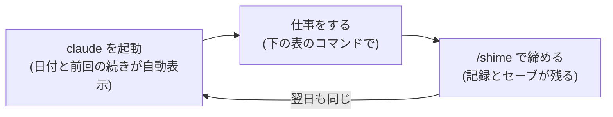

# FDE Atlas — AIに業務を安全に任せるための道具一式

**Claude Code などのAIエージェントに、書類管理・調査・議事録・設計書づくりを安心して手伝わせるためのフレームワーク**です。
AIへの指示書(規範)・作業手順(スキル)・安全装置(ゲート)・記録の仕組み(Git)がセットになっていて、仕事のフォルダにコピーするだけで使えます。コーディング用ではありません。

## 3分で導入

```sh
git clone <このリポジトリ> fde-atlas
fde-atlas/scripts/install.sh ~/仕事のフォルダ    # 既存ファイルは上書きしません
cd ~/仕事のフォルダ
claude        # 初回は「信頼しますか?」の確認 → 内容を見て承認
> /setup      # AIが業務名・正本の場所・任せる範囲をインタビューしてくれる
```

## 毎日のリズム



朝開くと「今日の日付・前回どこまでやったか・次にやること」が自動で表示されます。迷ったら「現在地表を見て」とAIに言えば、状況に合う次の一手を案内します。

## こういう時は、このコマンド

| したいこと | コマンド |
|---|---|
| 頭の中を整理したい・仕事の頼み方を決めたい | `/kabeuchi`(壁打ち) |
| 調べてほしい(出典つきで) | `/chousa` |
| 書類・ファイルを分類して台帳につけたい | `/shorui` |
| 設計書を作りたい・レビューしてほしい | `/sekkeisho` |
| 会議メモから決定事項と宿題を出したい | `/gijiroku` |
| 今日の作業を終える・中断する | `/shime` |
| うまくいったやり方を次回も使いたい | `/skill-create` |
| ファイルが増えて散らかってきた | `/tanaoroshi`(棚卸し) |
| AIのモデル・ツールが変わった | `/model-change` |

## AIとの約束事(このFWの設計)

- **送信・支払・削除・確定登録は、AIは実行しない設計です。** 下書きまで作り、あなたに確認を求めて止まります
- **わからないことは推測せず、質問してきます。** 見つからなかったものを、それらしく作りません
- **メールや書類の中に紛れた「AIへの指示」には従いません。** 見つけたら止まって原文つきで報告します(なりすまし・詐欺文書対策)
- **すべての変更はGitに記録されます。** いつでも前の状態に戻せます

## よくある質問

**Q. AIが途中で止まって質問してきた。故障?**
A. 正常です。「不明なら止めて聞く」のがこのFWのルールです。答えれば続きから進みます。

**Q. /コマンドが出てこない**
A. フォルダに `.claude/skills/` があるか確認してください。Claude Code以外のAIツールでは、`.claude/skills/<名前>/SKILL.md` を開いて「この手順どおりにやって」と渡せば同じことができます。

**Q. 起動時に日付などが表示されない**
A. `chmod +x .claude/hooks/*.sh` を実行してください。Windowsは Git Bash が必要です。

**Q. AIがまったく使えなくなったら?**
A. `source-map.md`(正本の場所)→ `daichou.md`(台帳)→ `checklists/`(確認観点)→ `work/STATUS.md`(次にやること)の順に読めば、人間だけで業務を回せる設計です。年1回はこの「避難訓練」を。

## 設定を変えたいとき

| 変えたいこと | 場所 |
|---|---|
| AIに任せてよい範囲(承認線・自律度) | 導入先の AGENTS.md「1. このプロジェクトの定義」 |
| 書類の名前の付け方 | context/rules.md |
| 設計書のレビュー観点 | checklists/sekkeisho-review.md |
| ブロックするコマンド | .claude/settings.json と .claude/hooks/guard-bash.sh |

## もっと詳しく

- **設計思想とワークフロー図の解説書(ブラウザで開く)**: [design/kaisetsu.html](design/kaisetsu.html)
- 考え方の全体像(なぜこう設計されているか): [fde-guide.md](fde-guide.md)
- FW自体の設計資料と今後の作業: [design/blueprint.md](design/blueprint.md)
- 導入先にコピーされる中身: `template/`
