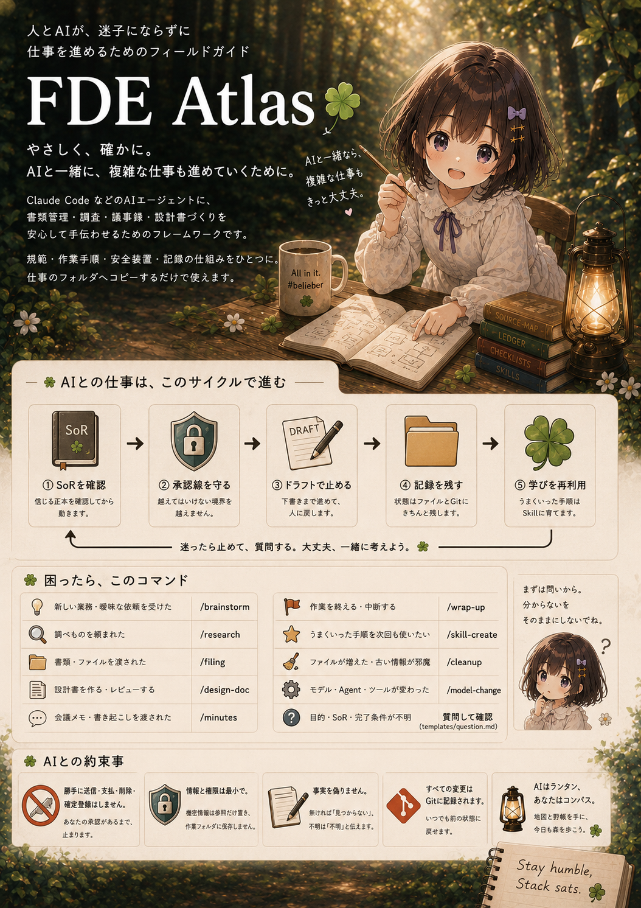

# FDE Atlas
非エンジニアが AI に業務を任せるための、薄い作業フォルダです。あなたが見るのは desk/(判断待ち)と docs/(成果物)だけ。

## 3分ではじめる
前提: Claude Code の `claude` コマンドが使えること。

1. 次のどれかで、このフォルダを手元に置く。GitHub の「Code → Download ZIP」で展開する。`git clone <URL>` を使う。「Use this template」で自分用を作る。
2. ターミナル(文字で指示する画面)でそのフォルダを開き、`claude` と入力する。
3. 「このフォルダを信頼しますか」と聞かれたら「はい」を選ぶ。
4. 「セットアップして」と入力する。まとめて出る質問に答える。分からなければ「未定」と答える。

## 毎日の流れ
1. `claude` で起動する。
2. 「前回の続き」と言う。担当が替わっても、同じ言い方でよい。
3. 仕事を頼む。
4. desk/ に票(判断をお願いする紙)が置かれたら答える。票のいちばん下の `Q1:` に はい/いいえ を書く。会話で伝えてもよい。AI が票に書き写す。
5. 「しめて」と言う。記録と commit(セーブ)まで AI が行う。

docs/ のファイルは、1行目が `状態: 案` なら確定前です。

## こんなときは、こう言う
| 言い方 | 起きること | コマンド |
|---|---|---|
| 「相談したい」「新しい仕事を任せたい」 | 質問しながら考えを整理する | /brainstorm |
| 「〜を調べて」 | 出典つきで調べる | /research |
| 「いま何をすればいい?」 | 机と STATUS を読んで答える | — |
| 「この票は はい」 | 票に書き写して進める | — |
| 「これを次も使いたい」 | 手順を道具として残す | /skill-create |
| 「しめて」 | 記録と commit まで行う | /wrap-up |
| 「セットアップして」 | 質問に答えて初期設定をする | /setup |

## 必要なら足す
packs/ の中身です。

| pack | できること | コマンド |
|---|---|---|
| minutes | 会議メモから決定と宿題を抜き出す | /minutes |
| si-documents | 書類の台帳と設計書をつくる | /filing・/design-doc |

「セットアップして」で「会議の議事録も扱いますか?」「書類の台帳・設計書も扱いますか?」と聞かれます。はい と答えると入ります。後から足すときも「セットアップして」と言います。ここに無いものは、フォークした先で足します(fde-guide.md 10章)。

## 困ったとき
- AI が止まって質問するのは正常です。承認が要る操作と、分からないことがあるときに止まる作りです。
- 止まったら、desk/ に票が置かれています。
- 起動時に「git がありません」と出たら、「セットアップして」と言います。

## 設計の考え方
- [fde-guide.md](fde-guide.md): 原則と、同梱しないもの。
- [.atlas/](.atlas/): 保守者向けの設計書・調査・テスト。業務に使うフォルダでは消してかまいません。

License: [MIT](LICENSE)
