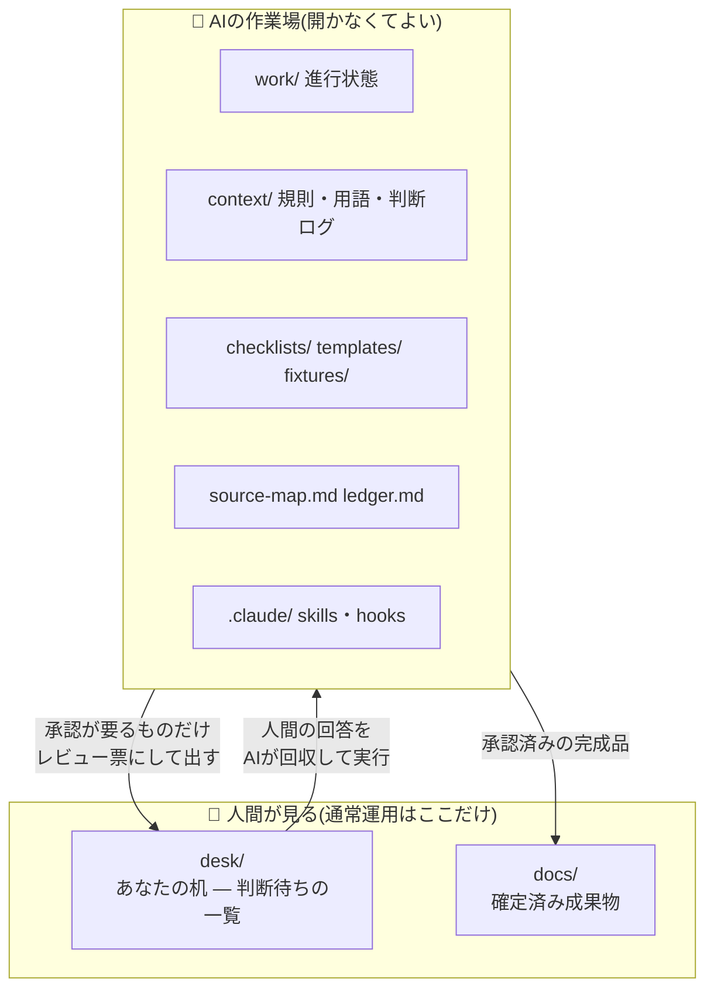
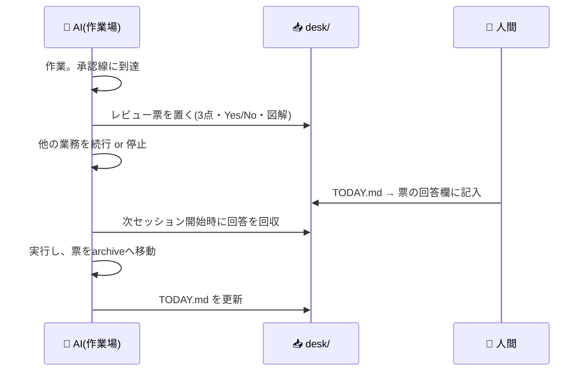

# 設計案: 人間が見るDirとAIが見るDirの分離(desk/ 構想)

> 状態: **提案(人間の承認待ち)**
> 動機: 実運用2期を通じて人間のレビュー負荷がボトルネックになった。人間が見るべき場所を1箇所に絞り、そこに置くものの「型」を規定する。
> 準拠: feedback 2.0(規範には型を、手順はSkillへ)・2.10(同梱資産の二分)

## 結論(3点)

1. **人間が通常運用で開く場所を `desk/` と `docs/` の2つだけにする。** それ以外のディレクトリは「AIの作業場」であり、人間は開かなくてよいとREADME・AGENTS.mdで明言する。
2. **人間の目に触れさせたいものは、AIは `desk/` 経由でしか出せない**(承認線の物理化)。`desk/` に無い = 見なくてよい、を成立させる。
3. **`desk/` に置くレビュー票は型を強制する**: 判断ポイント3点以内・Yes/Noで答えられる問い・Mermaid図で構造を図解・全文は参照リンク。全文をコピーして置くことを禁じる。
4. **「絞る」とは判断点の数を絞ることであり、説明を削ることではない。** 十分な説明はレビュー負荷を減らす。票は、リンクを開かなくても判断できる自己完結を目指す(背景・選択肢・それぞれを選んだ場合の帰結を票内に書く)。リンクは判断のためではなく検証のために付ける。

## 問題定義

現状、人間の注意を要するものが4箇所以上に散っている:

| 現在の置き場 | 中身 |
|---|---|
| work/STATUS.md「人間の手作業待ち」 | 承認線・フックが止めた作業 |
| work/<業務名>/ 内の承認依頼・質問 | templates/approval-request.md・question.md の記入済み |
| docs/ | レビュー待ちと確定済みの成果物が混在 |
| セッション末尾の会話 | 口頭の確認依頼(ファイルに残らないことがある) |

散っている結果、人間は「全部見るか、見落とすか」の二択になり、レビュー負荷が下がらない。さらに承認依頼が全文ベタ貼りで届くため、1件あたりの読解コストも高い。

## 全体構造



例外は避難訓練(AIが使えない時)のみ: source-map.md → ledger.md → checklists/ → work/STATUS.md の順に人間が直接読む。この経路は現行どおり残す。

## desk/ の中身

```
desk/
├── TODAY.md        ← まずこれ。判断待ちの一覧(1件1行)+ 業務の現在地図
├── a-0001-<件名>.md ← レビュー票(1件1ファイル。回答欄に直接書き込む)
└── a-0002-<件名>.md
```

- **TODAY.md** は /wrap-up が再生成するダッシュボード。判断待ち件数・各1行要約・業務の現在地をMermaidで図示する。人間は毎朝これだけ見れば現在地がわかる。
- **レビュー票** は「要判断」だけを置く。FYI(報告のみ)は TODAY.md の1行に留め、ファイルを作らない(読む義務を増やさない)。
- 回答済みの票は AIが /wrap-up で回収し、`work/<業務名>/archive/` へ移す。**desk/ に残っている = 未回答**、が常に成り立つ。
- 件数上限(既定7件)を超えたら hooks で警告する(上限は機械チェックで発火させる — feedback第1期2.2の学びに従う)。

## レビュー票の型(templates/review-ticket.md として同梱)

票は**リンクを開かなくても判断できる自己完結**を目指す。判断点は3点以内に絞るが、その3点それぞれに「なぜ判断が要るのか・選ぶとどうなるのか」の説明を付ける。説明を削って短くした票は、結局リンク先を全部読ませることになり、レビュー負荷を desk/ の外へ移しただけになる。

```markdown
# a-0001: <件名>
業務: <work/のフォルダ名> | 期限: YYYY-MM-DD | 種別: 承認/選択/確認

## 背景(3〜5行。この判断がなぜ必要になったか)
…

## 判断ポイント(3点以内。各点に「選ぶとどうなるか」を添える)
1. …(Yesの場合: … / Noの場合: …)
2. …

## 図解(何がどう変わるか)
(Mermaidで構造・前後比較・影響範囲を図示。必須)

## 問い(Yes/Noで答えられる形)
- [ ] Q1: …してよいですか?
- [ ] Q2: …

## 回答欄(人間がここに直接書く)
> 

検証用リンク: <work/またはdocs/への相対リンク>(判断はここまでで完結する。リンクは疑ったときの検証用)
```

## 運用フロー



## 規範への反映(型だけをガイドへ、手順はSkillへ)

| 反映先 | 内容 |
|---|---|
| fde-guide.md §6(承認線) | 「人間へ戻す操作は desk/ のレビュー票でのみ戻す。会話だけの承認依頼は記録に残らないため禁止」の1項を追加 |
| fde-guide.md §10(書き方) | レビュー票の型(3点以内・Yes/No・図解必須・票内で自己完結)を規範化。「絞る=判断点を絞ること。説明を削ることではない」を既存の「短く=再構成であって削除ではない」と対の規範として置く |
| AGENTS.md §11 場所の地図 | desk/ を先頭に追加し、「人間が見るのは desk/ と docs/ だけ」を明記 |
| /wrap-up Skill | 手順に「desk/回収 → TODAY.md再生成」を追加(STATUS「人間の手作業待ち」は desk/ へ移管し、STATUSからは参照のみ) |
| README.md | 「あなたが見るのはこの2つだけ」の節を追加(非エンジニア向けの最重要メッセージ) |

## 移行の影響範囲

- 既存ディレクトリは**移動しない**(work/等の物理移動はガイド全§のパス参照を壊すため見送り。分離は「desk/の新設 + 見なくてよい宣言」で達成する)
- 新規: `desk/TODAY.md`・`templates/review-ticket.md`・hooks の件数チェック
- **相殺(資産を純増させない)**: `templates/approval-request.md`(11行・第1期で使用実績なし)は review-ticket.md に統合して廃止する。質問(question.md)は一括質問用として別役割なので残す
- 変更: AGENTS.md(§11・承認線)・wrap-up/SKILL.md・work/STATUS.md(手作業待ちの移管)・README.md・fde-guide.md(§6・§10)・install.sh(desk/作成)

---

## この設計書への問い(Yes/Noで)

- [ ] Q1: 人間が見る場所を desk/ + docs/ の2つに絞る方針でよいですか?
- [ ] Q2: FYIは票にせず TODAY.md の1行に留める(読む義務を作らない)方針でよいですか?
- [ ] Q3: ディレクトリ名は `desk/` でよいですか?(代案: `for-human/`・`inbox/`)
- [ ] Q4: 実装(テンプレ・ガイド改訂)へ進んでよいですか?

## 回答欄

> 
