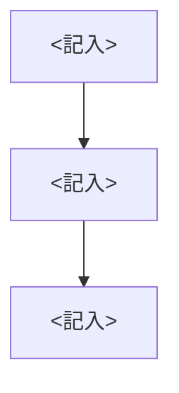

状態: 案
> 用途: SI要件定義書の骨子テンプレ。design-doc スキルの作成モードが使う。元ネタに無い内容は【未確定】と書く(捏造禁止)。<記入>は埋めるか、分からなければ【未確定】にする。図は Mermaid(矢印でつなぐと図になる書き方)。docs/ に保存するときはこの行を消す。

# 要件定義書: <記入>

## 業務フロー(概要)

## 目的・背景
<記入>

## 用語
用語の定義は同じフォルダの glossary.md(.claude/skills/design-doc/glossary.md)に揃える。無ければ作る。新出用語は追記案を提示してから登録する。

## 業務要件
<記入>

## 機能要件
| ID | 名称 | 概要 | 優先度 |
|---|---|---|---|
| <記入> | <記入> | <記入> | <記入> |

## 非機能要件
<記入>

## 前提・制約
<記入>

## 【未確定】一覧
- <記入>

## 変更履歴
| 版 | 日付 | 変更内容 |
|---|---|---|
| <記入> | <記入> | <記入> |
