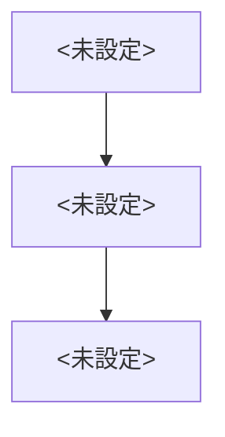
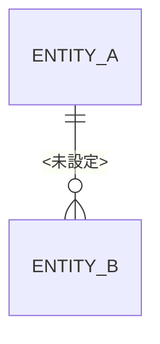

> 用途: SI基本設計書の骨子テンプレ。design-docスキルの作成モードが使う。元ネタに無い内容は【未確定】と書く(§9 捏造禁止)。

# 基本設計書: <未設定>

## 概要
<未設定>

## システム構成

## 機能設計
| 機能 | 入力 | 処理 | 出力 |
|---|---|---|---|
| <未設定> | <未設定> | <未設定> | <未設定> |

## 画面一覧
| ID | 画面名 | 概要 |
|---|---|---|
| <未設定> | <未設定> | <未設定> |

## 帳票一覧
| ID | 帳票名 | 概要 |
|---|---|---|
| <未設定> | <未設定> | <未設定> |

## 外部IF一覧
| ID | 接続先 | 方向 | 概要 |
|---|---|---|---|
| <未設定> | <未設定> | <未設定> | <未設定> |

## データ設計

### 主要エンティティ
| エンティティ | 主なカラム | 備考 |
|---|---|---|
| <未設定> | <未設定> | <未設定> |

## 【未確定】一覧
- <未設定>

## 変更履歴
| 版 | 日付 | 変更内容 |
|---|---|---|
| <未設定> | <未設定> | <未設定> |
