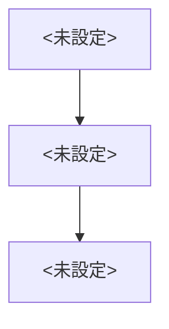

> 用途: SI要件定義書の骨子テンプレ。design-docスキルの作成モードが使う。元ネタに無い内容は【未確定】と書く(§9 捏造禁止)。

# 要件定義書: <未設定>

## 業務フロー(概要)

## 目的・背景
<未設定>

## 用語
用語の定義は context/glossary.md を参照する。新出用語は追記案を提示してから glossary.md へ登録する。

## 業務要件
<未設定>

## 機能要件
| ID | 名称 | 概要 | 優先度 |
|---|---|---|---|
| <未設定> | <未設定> | <未設定> | <未設定> |

## 非機能要件
<未設定>

## 前提・制約
<未設定>

## 【未確定】一覧
- <未設定>

## 変更履歴
| 版 | 日付 | 変更内容 |
|---|---|---|
| <未設定> | <未設定> | <未設定> |
