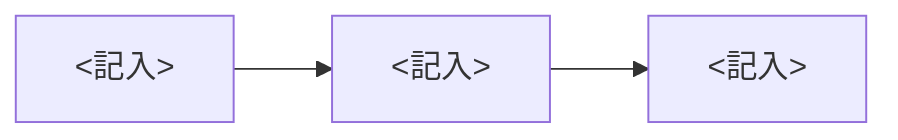

<!-- 絞る=判断点を絞ること。説明は削らない。置き場は desk/YYYYMMDD-<件名>.md、1件1ファイル。リンクを開かなくても判断できるように書き、全文のコピーは置かずリンクにする。図解と回答の節は必ず残す(回答の4行は空のまま)。ほかの使わない節と <記入> は消してから置く。回答あり=回答の Q<数字>: か ひとこと: の後に文字がある -->
# <記入: 何を決めるかが分かる1文>
業務: <記入> | 種別: 承認・選択・確認・質問・違和感 のどれか | 期限: YYYY-MM-DD | 急ぎ: はい(答えが出るまで、この業務は進みません)・いいえ
> 問いの番号ごとに、いちばん下の『回答』の Q1: Q2: のあとに答え(はい・いいえ など)を書いて保存し、AI に「票に答えた」と伝えてください。会話で答えても構いません(AI が書き写します)。人間が行う操作は、済んだら ひとこと: に『実行済み』と書いてください。
## 結論(AIのおすすめ)
<記入: 1〜2行>
## 背景
<記入: 3〜5行>
## 判断ポイント
1. <記入: 3つまで。理由1行>
   はいなら: <記入: 誰が何をするか> / いいえなら: <記入>
## 図解
<記入: 構造・前後比較・影響範囲のどれかを平文で1文。下の mermaid は図のソース。エディタでは読み飛ばしてよい>

## 問い
1. <記入>してよいですか?
## 違和感のとき
- 検知場所: <記入: 違和感のみ>
- 原文の引用(要約しない): <記入>
- 止めた操作: <記入>
## AIが確かめたこと
- 根拠: <記入: 正本と確認日>
- 実行済みでないことの確認: <記入>
- 戻し方: <記入>
## 回答
Q1: 
Q2: 
Q3: 
ひとこと: 
検証用リンク: <記入: work/ か docs/ のパス>
