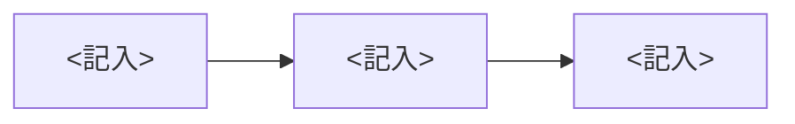

<!-- 絞る=判断点を絞ること。説明は削らない。置き場は desk/YYYYMMDD-<件名>.md、1件1ファイル。リンクを開かなくても判断できるように書き、全文のコピーは置かずリンクにする。使わない節と <記入> は消してから置く -->
# <記入: 何を決めるかが分かる1文>
業務: <記入> | 種別: 承認・選択・確認・質問・違和感 のどれか | 期限: YYYY-MM-DD | 急ぎ: はい(答えるまで AI は止まっています)・いいえ
> いちばん下の『回答』の Q1: のあとに はい か いいえ を書いて保存してください。会話で伝えても構いません(AI が書き写します)。
## 結論(AIのおすすめ)
<記入>
## 背景
<記入>
## 判断ポイント
1. <記入> はいなら: … / いいえなら: …
## 図解
<記入: 図と同じ内容を平文で1文>

## 問い
1. <記入>してよいですか?
## 違和感のとき
- 検知場所: <記入>
- 原文の引用(要約しない): <記入>
- 止めた操作: <記入>
## AIが確かめたこと
- 根拠: <記入: 正本と確認日>
- 実行済みでないことの確認: <記入: 何で確かめたか>
- 戻し方: <記入>
## 回答
Q1: 
Q2: 
Q3: 
ひとこと: 
検証用リンク: <記入>
